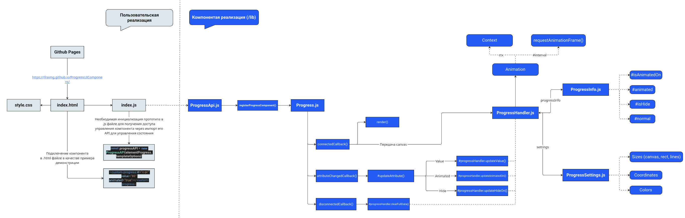
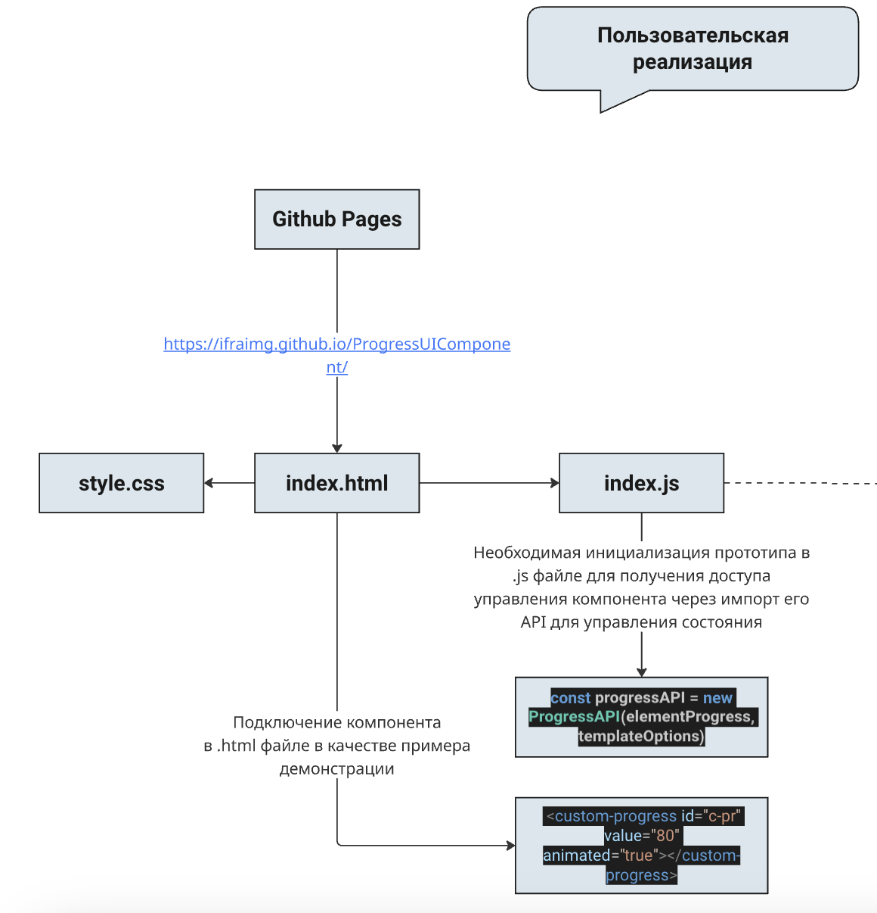
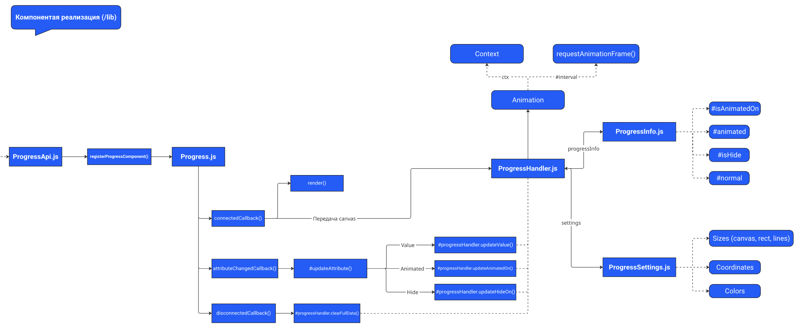
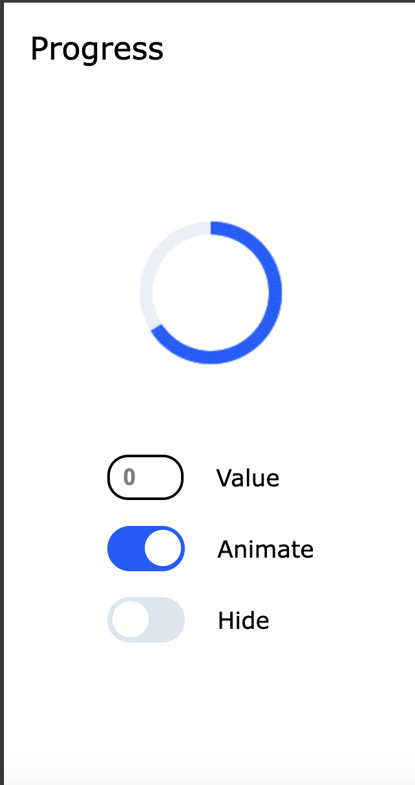
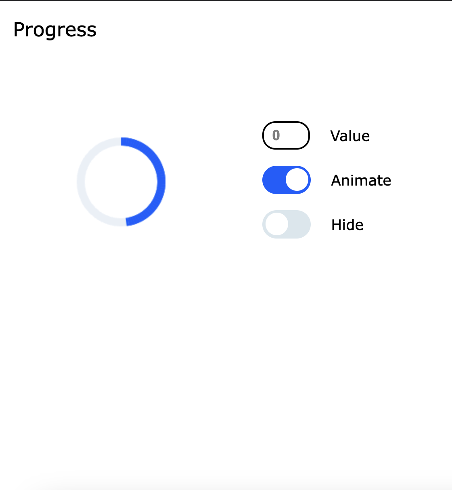

## Разработка прототипа блока Progress для использования в мобильных web-приложениях.

Отображение процесса выполнения процессов и их прогресса выполнения.

____

## Необходимые шаги для подключения компонента Progress в другой проект

1. Импортировать папку `lib/`
2. Вставить в код файла формата .html: (в атрибутах указаны значения по умолчанию)
``` html
<custom-progress id="c-pr" value="0" animated="true" hide="false"></custom-progress>
```
3. Получить элемент обращением к DOM в JavaScript файле: (в options указаны значения по умолчанию)
``` javascript
import ProgressAPI from "/lib/ProgressApi.js"

const elementProgress = document.getElementById("c-pr")
const options = { value: 80, animated: true, hide: false }

const progressAPI = new ProgressAPI(elementProgress, options)

```
4. Управление компонентом Progress осуществляется через данный экземпляр: (пример)
``` javascript
const normalNumber = document.getElementById("normal")
const animateCheckbox = document.getElementById("animate")
const hideCheckbox = document.getElementById("hide")

normalNumber.addEventListener("change", event => progressAPI.updateValue(event.target.value))
animateCheckbox.addEventListener("change", event => progressAPI.updateAnimatedOn(event.target.checked))
hideCheckbox.addEventListener("change", event => progressAPI.updateHideOn(event.target.checked))
```
**Параметры options: (является необязательным к указанию, в том числе и в атрибутах html-тэга)**
``` javascript
options: {
  value: number, // (от 0 до 100). Указание положения прогресса в %. По умолчанию - 0.
  animated: boolean, // true / false. Переключение анимации прокрутки. По умолчанию - true.
  hide: boolean // true / false. Сокрытие и отображение Progress. По умолчанию - false.
}
```

____

## Структура

```
├── demo/                    -> Пример пользовательской настройки и инициализации компонента
│   ├── assets/                -> Изображения для README.md
│   ├── index.js               -> Инициализация ProgressAPI пользователем компонента
│   └── style.css              -> Стилизация страницы демонстрации (поля ввода, разметка)
├── lib/                     -> Организация компонента Progress
│   ├── ProgressApi.js         -> Блок API для управления состоянием. Ключевой файл для импорта компонента в проект
│   ├── Progress.js            -> Нативная реализация Web Components
│   ├── ProgressHandler.js     -> Работа с Canvas API, его контекстом и анимацией
│   ├── ProgressInfo.js        -> Управлением данными (normal, animated, hide)
│   ├── ProgressSettings.js    -> Конфигурация настроек canvas, которые не изменяются во время работы
├── index.html        
├── .gihtub                  -> Конфигурация для Github Pages
```

____

## Визуальная схема полной реализации

 

#### Детальный просмотр:
 

 


____
## Визуальное представление с адаптацией под мобильные устройства для экранов с шириной 320px и 568px.

<div style="display: flex; justify-content: center; align-items: center">
    
    
</div>
